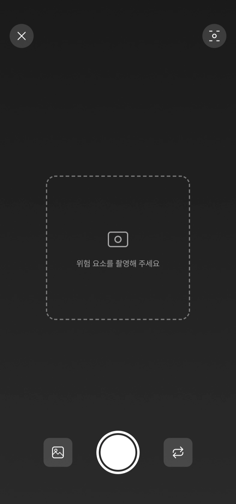
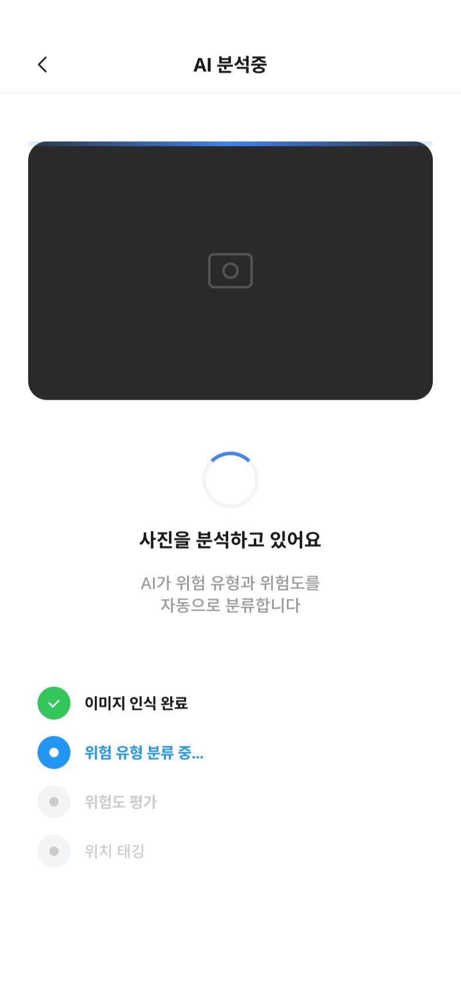
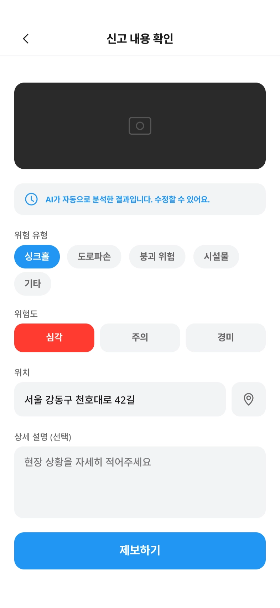
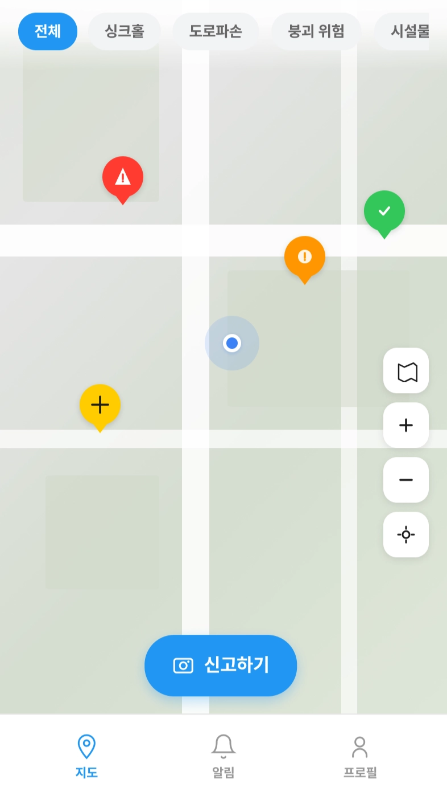
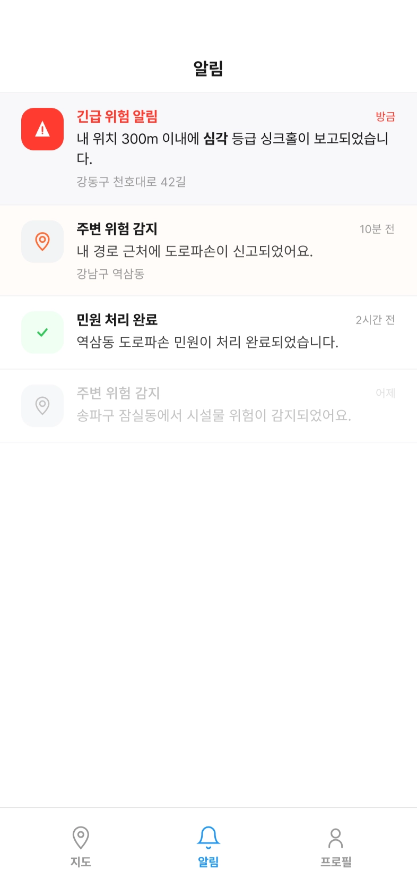
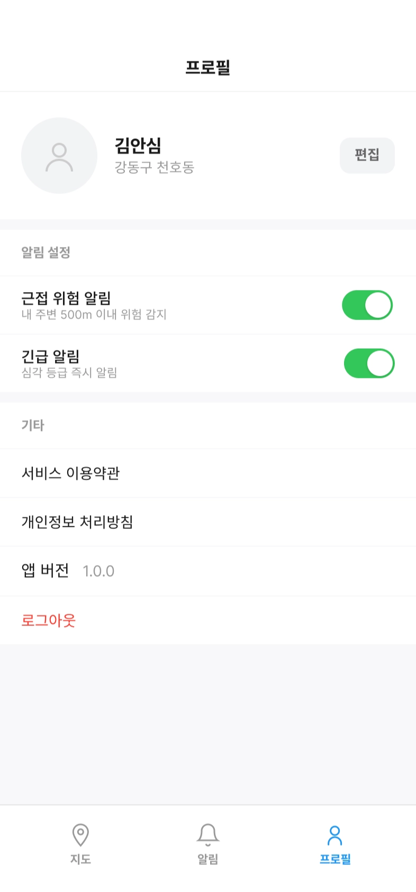
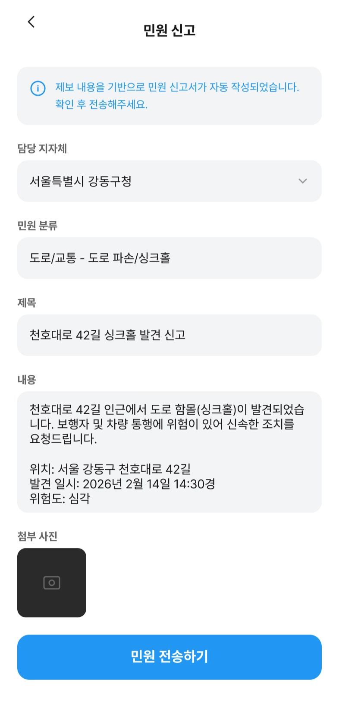

# 🚨 ansim-server

> 위험을 발견하면, **사진 한 장으로 신고**하세요  
> **AI가 분석**하고, 지도 위에서 **모두와 공유**됩니다

.png>)

---

## 🚨 문제 정의

> **위험은 발견됐지만, 전달되지 않았습니다.**

매년 반복되는 도시 안전사고, 공통점이 뭔지 알고 계시나요?

---

### 📌 실제 사고 사례

#### 📍 2025 · 강동구 싱크홀

사고 발생 전 이미 이상 징후에 대한 민원이 접수된 상태였으나
해당 구간을 지나는 주민들에게는 어떤 경보도 전달되지 않았습니다.

#### 📍 2023 · 분당 정자교 붕괴

붕괴 전 이상 징후를 목격한 주민이 있었지만, 실제 신고로 이어지지 않았습니다.

---

### 🔍 공통 문제

- 위험을 감지한 이웃
- 위험에 노출된 이웃
- 위험을 처리해야 할 지자체

👉 **이 세 주체가 서로 연결되지 않았습니다**

---

## 🌍 우리가 해결하려는 사회적 과제 (UN SDGs)

**안심은 SDG 11 — 지속가능한 도시와 커뮤니티를 목표로 합니다**

| 세부 목표 | 연결 포인트                     | 기대 사회적 가치     |
| --------- | ------------------------------- | -------------------- |
| **11.3**  | AI 간편 신고 + 지자체 민원 연계 | 디지털 민주주의 실현 |
| **11.5**  | 실시간 지도 시각화 + 근접 알림  | 사고 예방            |
| **11.7**  | 주민 참여형 커뮤니티            | 안전 사각지대 해소   |

---

## 💡 해결 방법

### 📸 사진 한 장으로 신고

복잡한 양식 없이 촬영 → **AI가 자동 분석**

<p align="center">
  
  
  
</p>

### 🗺️ 지도에서 실시간 공유

위험 정보를 지도에 마커로 표시 → **이웃과 즉시 공유**

<p align="center">
  
  
</p>

#### 🚦 위험도 단계

| 단계        | 의미 | 설명           |
| ----------- | ---- | -------------- |
| 🔴 Critical | 긴급 | 즉각 조치 필요 |
| 🟠 Warning  | 경고 | 잠재적 위험    |
| 🟡 Minor    | 경미 | 참고 수준      |
| 🟢 Resolved | 해결 | 조치 완료      |

### 🔔 실시간 알림 & 마이페이지

내 주변에 새로운 위험이 등록되면 **즉시 푸시 알림**  
**마이페이지**에서 프로필 수정과 알림 설정을 확인

<p align="center">
  
  
</p>

### 🏛️ 지자체까지 연결

앱 내에서 민원 폼 자동 생성 → **행정 처리까지 연결**

<p align="center">
    
</p>

---

## 🔄 서비스 동작 흐름

### 1️⃣ 위험 발견 & 촬영

→ 사진 촬영으로 즉시 신고

### 2️⃣ AI 자동 분석

→ 위험 유형 및 심각도 판별

### 3️⃣ 지도 공유

→ 위치 기반 마커 등록

### 4️⃣ 커뮤니티 참여

→ 댓글, 좋아요로 소통

---

## 🏗️ 기술 스택

### 📱 Frontend

- Flutter · Dart
- Material Design 3
- go_router · get_it

---

### ⚙️ Backend

- NestJS · TypeScript
- PostgreSQL · PostGIS
- Google Cloud Storage
- [백엔드팀 wiki 확인해보기](https://github.com/gdsc-ssu/ansim-server/wiki)

---

### 🧠 AI & Data

- 이미지 기반 위험 분석
- 공공 안전 데이터 연동
- 위치 기반 반경 검색

---

# ⚙️ 개발 환경

## 요구사항

- Node.js >= 24.12.0
- pnpm
- Docker & Docker Compose

---

## 🐳 Docker Compose 실행

```bash
# 실행
docker compose up --build

# 백그라운드 실행
docker compose up --build -d

# 종료
docker compose down

# 종료 + DB 삭제
docker compose down -v
```

👉 실행 후 `http://localhost:3000`로 접속 가능

---

### 📦 구성

| 서비스 | 설명                 | 포트 |
| ------ | -------------------- | ---- |
| app    | NestJS 서버          | 3000 |
| db     | PostgreSQL + PostGIS | 5432 |

---

### 🗄️ DB 정보

| 항목     | 값             |
| -------- | -------------- |
| Host     | localhost / db |
| Port     | 5432           |
| User     | ansim          |
| Password | ansim          |
| Database | ansim          |

---

## 💻 로컬 실행

```bash
pnpm install
pnpm run start:dev
```

`.env.example` → `.env` 복사 후 설정

---

## 🧬 마이그레이션

```bash
# 엔티티 변경사항 기반 마이그레이션 생성
pnpm migration:generate src/migrations/MigrationName

# 빈 마이그레이션 생성
pnpm migration:create src/migrations/MigrationName

# 마이그레이션 실행
pnpm migration:run

# 마지막 마이그레이션 롤백
pnpm migration:revert

# 스키마 전체 삭제
pnpm migration:drop
```

👉 개발 환경: `synchronize: true`

---

## 🧪 테스트

```bash
pnpm run test
pnpm run test:e2e
pnpm run test:cov
```

.png>)
